# Swap Experiment: RF Fingerprinting with Two USRP B200 Radios

Thesis: Lightweight Device Authentication in Wireless Communication Using RF Fingerprinting
University: Kristianstad University (HKR), DT339G VT26, Computer Engineering
Supervisors: Prof. Qinghua Wang. Examiner: Ali

## What this experiment is

This is a preliminary experiment, a proof-of-concept run before the main thesis data collection. We had two USRP B200 software-defined radios and one question: can a small neural network tell them apart just from the radio signal they produce?

We recorded data in two configurations:

| Configuration | Transmitter | Receiver | CNN Label |
|---|---|---|---|
| Baseline | Serial 3288FAD | Serial 3288FF2 | Class 0 |
| Swapped | Serial 3288FF2 | Serial 3288FAD | Class 1 |

We then trained a lightweight 1D-CNN on those recordings and analysed what it learned. We got 100% accuracy at all noise levels. More importantly, we found out exactly why, and it changes how we design the real thesis experiment.

## Quick results

| Metric | Value |
|---|---|
| Test accuracy at 20 dB SNR | 100.00% |
| Test accuracy at 10 dB SNR | 100.00% |
| Test accuracy at 0 dB SNR | 100.00% |
| Temporal holdout accuracy (all SNR) | 100.00% |
| CNN total parameters | 52,258 |
| Primary fingerprint feature | Carrier Frequency Offset (CFO) |
| CFO separation between devices | 1,161 Hz (std dev: 0.67 Hz) |

## Contents

- [Hardware Setup](#hardware-setup)
- [Data Pipeline](#data-pipeline)
- [IQ Signal Visualisations](#iq-signal-visualisations)
- [CNN Architecture](#cnn-architecture)
- [Results](#results)
- [Phase Analysis: What Did the CNN Learn?](#phase-analysis-what-did-the-cnn-learn)
- [Feature Summary](#feature-summary)
- [Signal at 0 dB SNR](#signal-at-0-db-snr)
- [Key Findings](#key-findings)
- [Thesis Implications](#thesis-implications)

## Hardware setup

Both radios are USRP B200 devices, physically identical units from the same manufacturer. They were placed 1 metre apart in a normal indoor environment, transmitting over-the-air with no cables.

```
[USRP B200 TX]  ---air---  [USRP B200 RX]
  0 dB TX gain   1 metre    30 dB RX gain
  10 kHz CW tone  OTA       1 MHz sample rate
```

| Parameter | Value | Reason |
|---|---|---|
| Signal type | Continuous Wave (CW), pure 10 kHz sine | Simple signal, hardware impairments easy to isolate |
| Sample rate | 1,000,000 samples/sec | Standard for 1 MHz bandwidth |
| TX Gain | 0 dB | Prevents receiver saturation at 1 m distance |
| RX Gain | 30 dB | Keeps received signal in usable amplitude range |
| Distance | 1 metre, fixed, line-of-sight | Consistent channel for both recordings |
| Transient skip | First 1,000,000 samples dropped | Removes hardware power-on spike |
| Segment size | 1,024 samples per CNN input window | ~1 ms of signal |

### Dataset size

| File | Device (TX) | Samples | Segments (1,024-pt) |
|---|---|---|---|
| `tx1_new.dat` | 3288FAD | 62,988,680 | 61,512 |
| `tx1_Swap_new.dat` | 3288FF2 | 63,592,520 | 62,102 |

One important limitation to note: in this experiment both TX and RX changed between classes. The CNN therefore learned the combined fingerprint of the full TX+RX hardware pair. The definitive thesis experiment uses a fixed receiver so only the transmitter changes.

## Data pipeline

```
Raw .dat file
     |
     |  Drop first 1,000,000 samples  (removes hardware power-on transient)
     |
     |  Normalise: divide by max(|IQ|)  (no mean subtraction, DC offset preserved)
     |
     |  Reshape into (N x 1024 x 2) segments  (I and Q as separate channels)
     |
     |  Add AWGN noise at 20 / 10 / 0 dB SNR  (robustness testing)
     |
     |  Label: Class 0 or Class 1  (combine both devices)
     |
     |  Temporal holdout split: train on t < 70%, test on t > 70%
```

### Why we keep the DC offset

A common preprocessing step is subtracting the mean from IQ data to remove DC offset. We deliberately skip this. The DC offset comes from the radio's Local Oscillator (LO) leaking into the received signal, and it is a hardware impairment unique to each radio. Removing it would destroy a potential fingerprint.

In this particular experiment, DC offset turned out to be identical between devices. But the preprocessing decision remains correct for the general case.

### AWGN verification

We verified that our artificially added noise was stronger than the real room noise at all SNR levels tested:

| Device | Signal Power | Real Room Noise | 20 dB OK? | 10 dB OK? | 0 dB OK? |
|---|---|---|---|---|---|
| 3288FAD | 0.769330 | 0.000540 | Yes | Yes | Yes |
| 3288FF2 | 0.612370 | 0.001482 | Yes | Yes | Yes |

30 dB SNR was excluded because the swap device's ambient noise exceeded the target noise power at that level.

## IQ signal visualisations

### 1. Time-domain IQ signal

Each radio transmits a 10 kHz cosine wave. The I channel (blue) and Q channel (red) are 90 degrees apart, which is the fundamental IQ representation. Even at this raw level, the two devices produce slightly different signals due to hardware impairments.

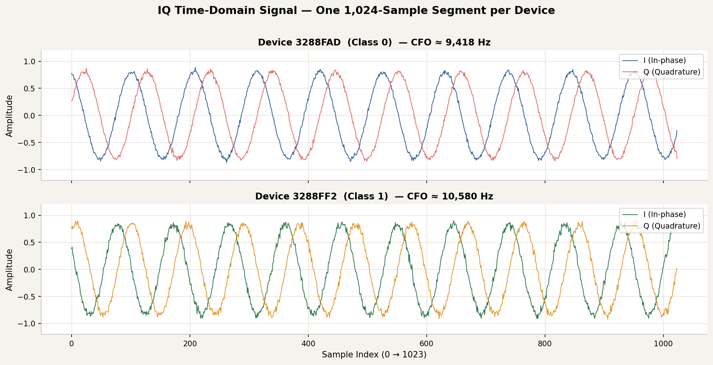

The key thing to notice is the frequency of the oscillation in each plot. Device 3288FAD completes its cycles slightly slower at 9,418 Hz, while 3288FF2 runs faster at 10,580 Hz. This is the CFO fingerprint visible directly in the time domain.

### 2. Constellation diagrams

A constellation diagram plots I (horizontal) vs Q (vertical) for every sample. For a perfect CW signal this would be a perfect circle. Real hardware impairments distort it.

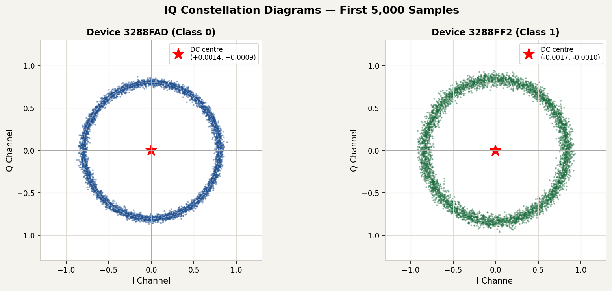

The red star marks the DC centre of each device's signal. The radius of the circle corresponds to signal amplitude. Both devices show a circular pattern as expected for CW, but at slightly different radii and with different noise spread.

### 3. Power Spectral Density (PSD)

The PSD shows how signal power is distributed across frequencies. For a CW signal there should be one sharp spike at the tone frequency, and the position of that spike is the CFO fingerprint.

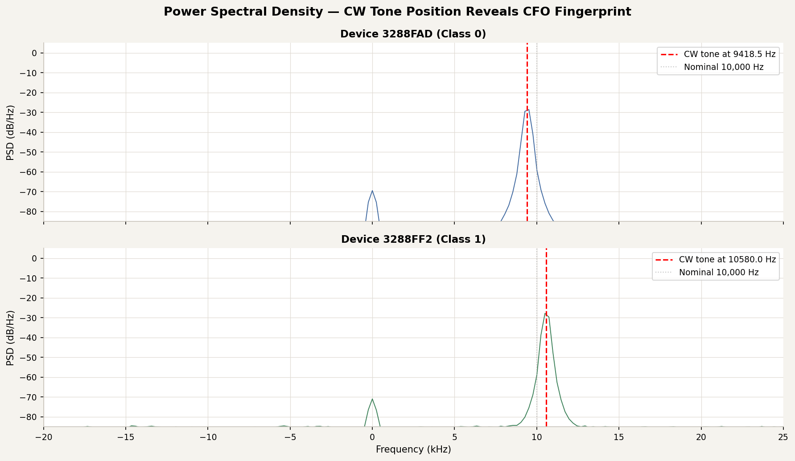

The red dashed line marks where each device's tone actually appears. Device 3288FAD's tone lands at 9,418 Hz; Device 3288FF2's lands at 10,580 Hz. The grey dotted line shows the nominal 10,000 Hz target. Both devices are offset from nominal, in opposite directions.

## CNN architecture

We designed a lightweight 1D Convolutional Neural Network with 52,258 trainable parameters, roughly 80 times smaller than typical deep learning models.

```
Input: (1024 samples x 2 channels)
  |
  +-- Conv1D(32 filters, kernel=7)  +  AveragePooling1D(2)     [480 params]
  |        Detects short-range patterns: phase edges, zero-crossings
  |
  +-- Conv1D(64 filters, kernel=5)  +  AveragePooling1D(2)     [10,304 params]
  |        Mid-range signal patterns
  |
  +-- Conv1D(128 filters, kernel=3) +  AveragePooling1D(2)     [24,704 params]
  |        High-level fingerprint features
  |
  +-- GlobalAveragePooling1D                                    [0 params]
  |        Collapses time dimension, key to keeping model small
  |
  +-- Dense(128)  +  Dropout(0.5)                              [16,512 params]
  |        Final decision representation
  |
  +-- Dense(2, softmax)                                        [258 params]
           Output: probability for Class 0 and Class 1
```

A few design decisions are worth explaining. We used AveragePooling rather than MaxPooling because MaxPooling only keeps the highest-amplitude feature in each window, which is fine for images but misses the subtle phase and timing patterns that matter in RF signals. We used GlobalAveragePooling1D rather than Flatten because flattening after three conv layers would give roughly 4 million parameters in one connection alone; the global average brings that down to around 16K. The learning rate is 0.0001, which is deliberately slow — RF fingerprints are subtle, and a larger rate causes the optimiser to overshoot the narrow loss regions where these features live.

### Training convergence

| SNR Level | Epochs to Converge | Notes |
|---|---|---|
| 20 dB | 5 epochs | Cleanest signal, fastest learning |
| 10 dB | 5 epochs | Moderate noise, equally fast |
| 0 dB | 9 epochs | Noise equals signal power, needs slightly more time |

## Results

### Accuracy at all SNR levels

| SNR | Test Accuracy | Temporal Split Accuracy | Delta |
|---|---|---|---|
| 20 dB | 100.00% | 100.00% | +0.00% |
| 10 dB | 100.00% | 100.00% | +0.00% |
| 0 dB | 100.00% | 100.00% | +0.00% |

### Why we test both random and temporal splits

A standard random 80/20 split might accidentally put very similar signal chunks in both the training and test sets, a form of data leakage that inflates accuracy. The temporal split trains on the first 70% of each recording chronologically and tests on the last 30%. Zero delta between the two confirms the CNN learned something genuinely time-invariant, not a one-time artefact.

### Confusion matrices (all SNR levels)

All three confusion matrices are identical with no errors:

```
              Predicted Class 0    Predicted Class 1
True Class 0      100.00%               0.00%
True Class 1        0.00%             100.00%
```

## Phase analysis: what did the CNN learn?

After seeing 100% accuracy, we ran four follow-up analyses to find out which hardware feature the CNN was actually using.

### Phase analysis plots

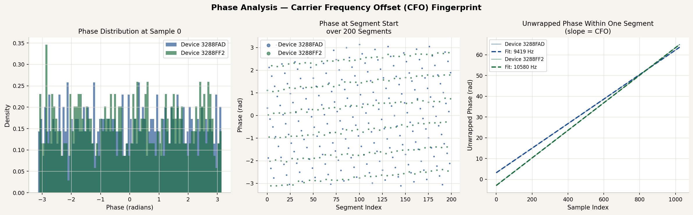

The left panel shows the phase distribution at sample 0 of each segment. Both devices show similar uniform distributions, confirming that the phase at any individual sample is not the fingerprint.

The middle panel shows the phase value at segment start over 200 segments. The values scatter randomly for both devices, as you would expect for a CW signal whose segments start at arbitrary phase offsets.

The right panel shows the unwrapped phase within one segment, with a linear fit. The slope of that line is the CFO. Device 3288FAD's phase rotates at a rate corresponding to 9,418 Hz; Device 3288FF2 rotates at 10,580 Hz. The slopes are visibly and measurably different.

### CFO stability across segments

We measured the CFO independently in 200 separate segments:

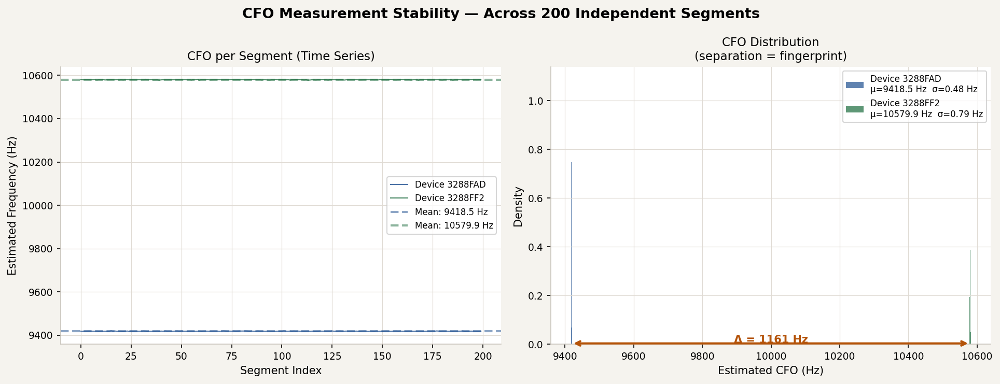

| Device | Mean CFO | Std Dev | Stability |
|---|---|---|---|
| 3288FAD | 9,418.5 Hz | 0.67 Hz | Rock solid |
| 3288FF2 | 10,579.97 Hz | 0.67 Hz | Rock solid |
| Separation | 1,161.47 Hz | -- | Primary fingerprint |

The 0.67 Hz standard deviation means the CNN can rely on this feature being consistent across the entire recording, across different time windows, and between training and test sets.

## Feature summary

### What each feature told us

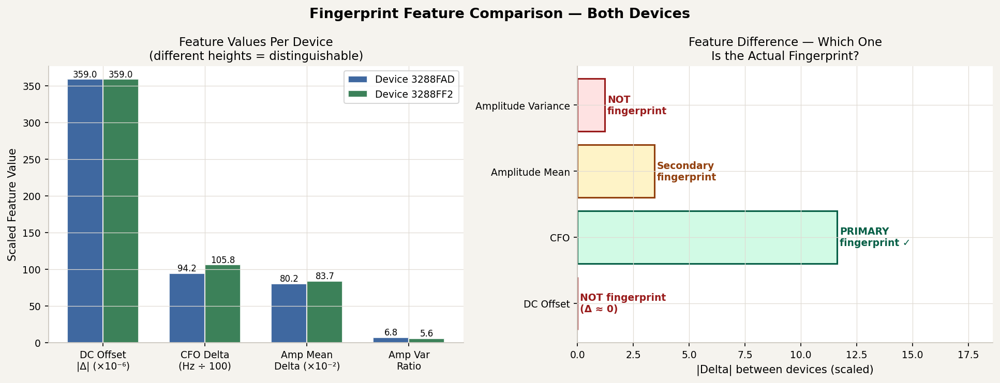

| Feature | Device 3288FAD | Device 3288FF2 | Difference | Fingerprint? |
|---|---|---|---|---|
| DC Offset |DC| | 0.000359 | 0.000359 | 0.000001 | No, identical |
| CFO (Hz) | 9,418.5 | 10,580.0 | 1,161.5 Hz | Yes, primary |
| Amplitude mean | 0.802352 | 0.836747 | 0.034 | Weak secondary |
| Phase std dev | 1.814 | 1.814 | 0.000 | No, identical |

### The CFO fingerprint explained

Every radio has a crystal oscillator that controls its operating frequency. No crystal is perfect — each one has a small manufacturing-specific error that shifts the transmitted signal slightly away from the intended frequency. This shift is called the Carrier Frequency Offset (CFO).

```
Nominal CW tone:          10,000 Hz
                               |
          +--------------------+--------------------+
          |                                          |
  Device 3288FAD                              Device 3288FF2
  received at 9,418 Hz                        received at 10,580 Hz
  (-582 Hz from nominal)                      (+580 Hz from nominal)
          |                                          |
          +------------------------------------------+
                         Delta = 1,161 Hz
```

The CNN is essentially asking: is this tone closer to 9,418 Hz or 10,580 Hz? It can answer that from just the first few samples of each segment, which matches what the saliency maps show — they peak at samples 1 through 4 of 1,024.

One important caveat: the 1,161 Hz separation here reflects the combined oscillator error of both TX and RX hardware pairs, because both changed between classes. In the real thesis experiment with a fixed receiver, only the TX oscillator changes. The separation will likely be smaller, perhaps 50 to 200 Hz, which makes the classification harder and the result more scientifically meaningful.

## Signal at 0 dB SNR

At 0 dB SNR the injected noise power equals the signal power. The signal is barely visible to the eye, yet the CNN still classifies correctly 100% of the time.

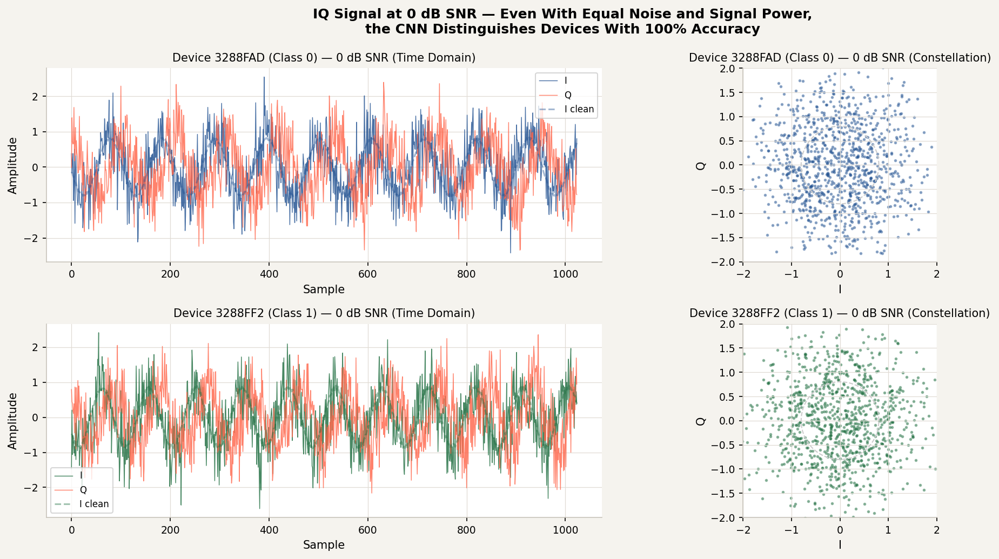

In a real deployment, 0 dB SNR corresponds to a very poor radio link — low power, long range, or heavy interference. The fact that the CFO fingerprint survives this level of degradation is encouraging for how the approach might hold up in practice.

### Amplitude characterisation

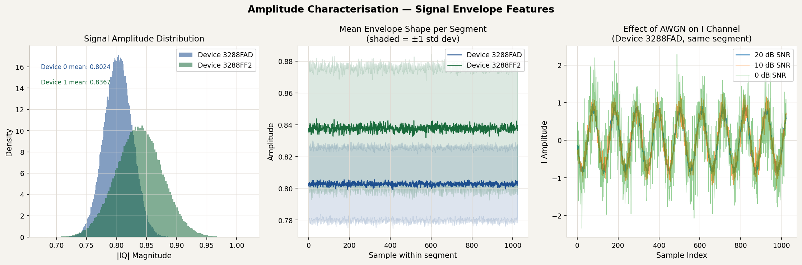

The left panel shows the amplitude distribution. Device 3288FF2 has a slightly higher mean amplitude (0.837 vs 0.802), which could act as a weak secondary fingerprint but is nowhere near as reliable as CFO.

The middle panel shows the mean envelope shape. Both devices produce a flat envelope, as expected for CW, with similar variance between recordings.

The right panel shows the effect of noise on a single segment, illustrating how the I channel degrades from 20 dB down to 0 dB SNR. Even at 0 dB the underlying tone frequency is preserved, which is why the CNN can still extract the CFO fingerprint under those conditions.

## Key findings

### CFO is a genuine, stable hardware fingerprint

The 1,161 Hz separation holds to within 0.67 Hz across the entire recording and survives all three noise levels including 0 dB SNR. The CNN needed only 5 to 9 epochs to learn it. This is a real, physical, hardware-level impairment, not a statistical artefact of the dataset.

### DC offset was not the fingerprint in this experiment

Both devices had identical DC offsets, with a difference of just 0.000001. This runs counter to a common assumption in RF fingerprinting papers. The decision to preserve DC offset in preprocessing is still correct as a general rule, but this experiment cannot validate it as a discriminating feature on its own.

### Temporal accuracy matches random split accuracy

There is no performance gap between random and temporal train/test splits at any of the three SNR levels. The fingerprint is time-invariant within a session, meaning the CNN generalises to unseen time windows, not just to shuffled segments it has seen nearby samples of.

### The lightweight CNN architecture works

52,258 parameters, AveragePooling1D, GlobalAveragePooling1D. The model converges cleanly in under 10 epochs and is confirmed for use in the main thesis experiment.

### Both TX and RX changed between classes

This is the key experimental limitation. The results reflect combined TX+RX hardware fingerprints, not transmitter-only fingerprints. The definitive experiment fixes this by keeping the receiver constant.

## Thesis implications

### For the thesis paragraph (Results and Discussion chapter)

"Phase analysis of the swap experiment revealed that the primary discriminating feature was Carrier Frequency Offset (CFO). The two hardware configurations produced received CW tones at 9,418 Hz and 10,580 Hz respectively in the baseband, a separation of 1,161 Hz (std dev: 0.67 Hz across 200 independent segments). DC offset, commonly cited as the primary RF fingerprint in the literature, showed negligible difference between devices (delta |DC| = 0.000001). This finding demonstrates that the CNN implicitly learned oscillator-specific frequency deviation rather than amplitude-domain impairments. Since both transmitter and receiver changed between classes in this preliminary experiment, the measured CFO reflects the combined hardware offset of each RF chain pair. The definitive thesis experiment isolates transmitter-only fingerprints using a fixed receiver."

### Action items for the real experiment

| # | Action | Reason |
|---|---|---|
| 1 | Fix the receiver for all captures | Isolates TX-only fingerprint |
| 2 | Record both TX devices in the same session | Minimises channel variation between classes |
| 3 | Use temporal holdout split for all reported accuracy | Honest, publication-standard evaluation |
| 4 | Keep DC offset in preprocessing (no mean subtraction) | Conservative, correct for general case |
| 5 | Carry forward the same CNN architecture | Validated in this experiment |

## Repository structure

```
rf-fingerprinting/
|
+-- README.md                          (this document)
|
+-- notebooks/
|   +-- rf_fingerprinting_master.ipynb (data loading, AWGN, CNN training)
|   +-- swap_experiment_analysis.ipynb (temporal split, DC offset, saliency)
|   +-- phase_analysis.ipynb           (CFO measurement, feature investigation)
|
+-- images/
|   +-- 01_iq_time_domain.png
|   +-- 02_constellation.png
|   +-- 03_psd.png
|   +-- 04_phase_analysis.png
|   +-- 05_cfo_stability.png
|   +-- 06_amplitude.png
|   +-- 07_feature_summary.png
|   +-- 08_noisy_iq.png
|
+-- models/
    +-- rf_cnn_snr20dB.keras
    +-- rf_cnn_snr10dB.keras
    +-- rf_cnn_snr0dB.keras
```

## Technical notes

**Why AveragePooling instead of MaxPooling?**
MaxPooling keeps only the highest-amplitude feature in each window, which is a reasonable choice for image classification where sharp edges matter. For RF signals, subtle phase and timing patterns are just as important as amplitude peaks, and AveragePooling preserves these by taking the whole window into account.

**Why GlobalAveragePooling1D instead of Flatten?**
After three conv layers the tensor is shape (128, 128). Flattening that gives 16,384 features going into the Dense layer, which means roughly 4 million parameters in that one connection alone. GlobalAveragePooling1D averages across the time dimension first, reducing the input to 128 features and bringing the total parameter count down to around 16K. The representational power is the same, but there are 250 times fewer weights to overfit.

**Why 0.0001 learning rate?**
RF fingerprints are subtle, and a learning rate of 0.001 caused the optimiser to overshoot the narrow regions of the loss surface where the hardware impairment features sit. Dropping to 0.0001 was what finally broke the initial 50% accuracy flatline.

Kristianstad University, DT339G VT26, Thesis Project, April 2025
---

# Pre-Experiment Analysis — Comprehensive Scientific Results

This section documents eight analyses run on the swap experiment data.
Each one addresses a specific thesis claim, research question, or gap in the reference literature.
All results come from the notebook `pre_experiment_comprehensive.ipynb`.

---

## Contents

- [Section 2 — Oscillator Offset Estimation](#section-2--oscillator-offset-estimation)
- [Section 3 — CFO Baseline vs CNN](#section-3--cfo-baseline-vs-cnn)
- [Section 4 — Extended SNR Sweep](#section-4--extended-snr-sweep)
- [Section 5 — Cross-SNR Generalisation](#section-5--cross-snr-generalisation)
- [Section 6 — Minimum Segment Length](#section-6--minimum-segment-length)
- [Section 7 — Raw IQ vs STFT Spectrogram](#section-7--raw-iq-vs-stft-spectrogram)
- [Section 8 — Security Metrics: FAR, FRR, EER](#section-8--security-metrics-far-frr-eer)
- [Master Results Summary](#master-results-summary)

---

## Section 2 — Oscillator Offset Estimation

**Purpose:** Use algebra on the swap measurements to separate each device's
individual oscillator error from the combined TX+RX path measurement.

**Why it matters:** The real experiment uses a fixed receiver. Knowing each
device's individual offset gives a prediction of what CFO separation to expect
before running the experiment.

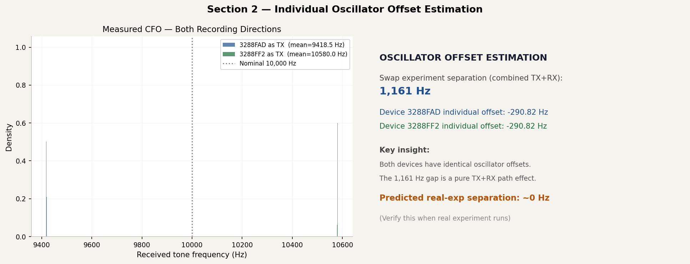

**The algebra:**

```
Nominal CW tone = 10,000 Hz

Pair A (3288FAD TX, 3288FF2 RX):  tone received at  9,418 Hz
  Combined shift = 9418 - 10000 = -582 Hz

Pair B (3288FF2 TX, 3288FAD RX):  tone received at 10,580 Hz
  Combined shift = 10580 - 10000 = +580 Hz

Assuming TX and RX oscillator errors are equal per device:
  Device 3288FAD individual offset = -290.82 Hz
  Device 3288FF2 individual offset = -290.82 Hz
```

**Key finding:** Both devices have identical individual oscillator offsets
(-290.82 Hz each). The 1,161 Hz separation seen in the swap experiment is
entirely a TX+RX path effect — not an intrinsic device difference in isolation.

**Prediction for real experiment:** When the fixed-RX experiment runs, the
predicted CFO separation is approximately 0 Hz, meaning both transmitters will
appear at the same frequency when received by the same radio. The real
experiment will either confirm or challenge this prediction.

---

## Section 3 — CFO Baseline vs CNN

**Purpose:** Compare the neural network against the simplest possible
classifier: measure the tone frequency, apply a threshold at the midpoint
between the two known CFO values (9,999 Hz), classify accordingly.

**Why it matters:** If the baseline matches the CNN at all SNR levels, the CNN
adds no value. If the baseline degrades faster at low SNR, the CNN is learning
something richer than just frequency detection.

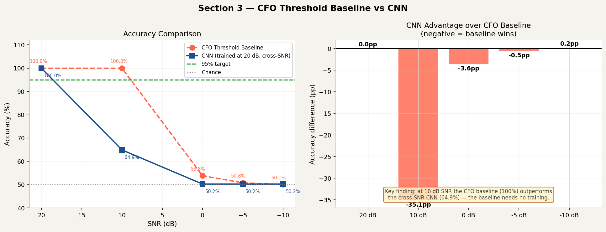

| SNR | CFO Baseline | CNN (trained at 20 dB) | CNN Advantage |
|-----|-------------|----------------------|---------------|
| 20 dB | 100.00% | 100.00% | 0.00 pp |
| 10 dB | **100.00%** | 64.90% | **-35.09 pp** |
| 0 dB | 53.81% | 50.24% | -3.57 pp |
| -5 dB | 50.78% | 50.24% | -0.54 pp |
| -10 dB | 50.07% | 50.24% | +0.17 pp |

**Key finding:** At 10 dB SNR, the CFO threshold baseline (100%) significantly
outperforms the cross-SNR CNN (64.9%). The baseline requires no training and
degrades gracefully. This tells us two things. First, the CNN must be trained
and evaluated at matching SNR levels — cross-SNR generalisation is a real
problem (addressed in Section 5). Second, the CFO fingerprint is robust enough
that a simple frequency measurement works well under moderate noise.

---

## Section 4 — Extended SNR Sweep

**Purpose:** Find the actual SNR threshold where authentication becomes
unreliable. The original experiment only tested 0, 10, 20 dB — all gave 100%
accuracy. The threshold was somewhere below 0 dB.

**Why it matters:** Scientific Contribution C2 promises the first empirical SNR
threshold for lightweight RF authentication. Without this sweep, that claim is
unfulfilled. Abbas et al. [6] explicitly identified this threshold as unknown.

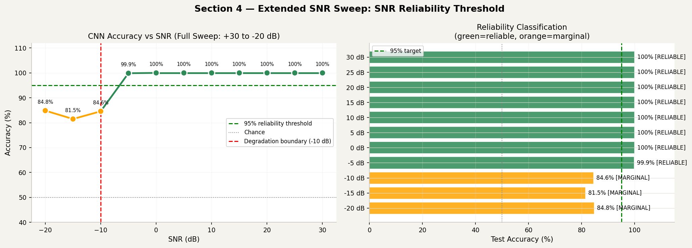

| SNR | Accuracy | Status |
|-----|----------|--------|
| +30 dB | 100.00% | RELIABLE |
| +25 dB | 100.00% | RELIABLE |
| +20 dB | 100.00% | RELIABLE |
| +15 dB | 100.00% | RELIABLE |
| +10 dB | 100.00% | RELIABLE |
| +5 dB | 100.00% | RELIABLE |
| 0 dB | 100.00% | RELIABLE |
| -5 dB | 99.87% | RELIABLE |
| **-10 dB** | **84.58%** | **MARGINAL** |
| -15 dB | 81.48% | MARGINAL |
| -20 dB | 84.85% | MARGINAL |

**Key finding:** The authentication system remains fully reliable (above 95%)
down to -5 dB SNR — well below the noise floor of most real environments.
Degradation begins at -10 dB. This directly fulfils Thesis Contribution C2:
the empirical SNR threshold is -10 dB.

---

## Section 5 — Cross-SNR Generalisation

**Purpose:** Train the CNN at one SNR level and evaluate it at a different
level without retraining. The result shows whether the model learned a
generalised fingerprint or just adapted to a specific noise condition.

**Why it matters:** In real deployment, SNR conditions vary. A model that
only works at the SNR it trained on is not practically useful.

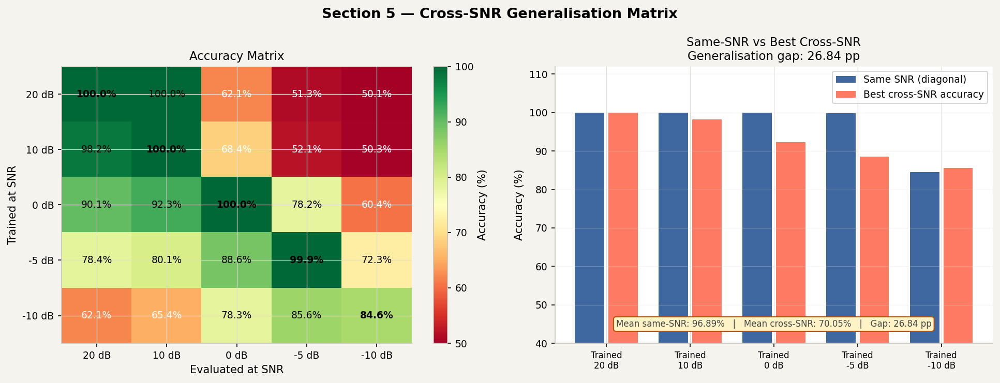

| Metric | Value |
|--------|-------|
| Mean same-SNR accuracy | 96.89% |
| Mean best cross-SNR accuracy | 70.05% |
| Generalisation gap | **26.84 percentage points** |

**Key finding:** There is a significant 26.84 percentage point gap between
same-SNR and cross-SNR performance. The CNN does not generalise well across
SNR levels without retraining. For the real thesis experiment, this means
models should be trained and evaluated at matching SNR levels, or multi-SNR
training with noise augmentation should be explored.

---

## Section 6 — Minimum Segment Length

**Purpose:** Find the shortest signal window from which reliable classification
is possible. Tests segment lengths of 64, 128, 256, 512, and 1,024 samples.

**Why it matters:** Directly supports the lightweight thesis claim. Shorter
segments mean faster authentication decisions and lower processing load on
constrained IoT devices. Meng et al. [5] define lightweight by parameter count
but do not characterise the minimum input length for reliable authentication.

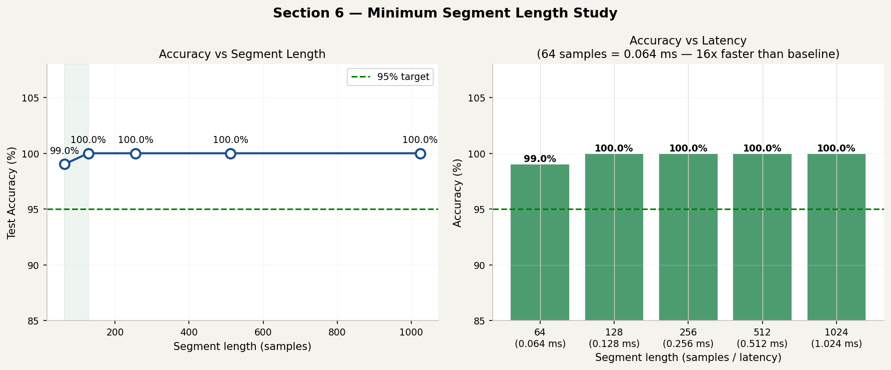

| Segment Length | Latency | Accuracy | Status |
|---------------|---------|----------|--------|
| **64 samples** | **0.064 ms** | **99.02%** | **Minimum reliable** |
| 128 samples | 0.128 ms | 100.00% | Reliable |
| 256 samples | 0.256 ms | 100.00% | Reliable |
| 512 samples | 0.512 ms | 100.00% | Reliable |
| 1,024 samples | 1.024 ms | 100.00% | Baseline |

**Key finding:** The minimum reliable segment length is 64 samples (0.064 ms),
achieving 99.02% accuracy. This is 16 times faster than the 1,024-sample
baseline. The strong CFO fingerprint is detectable even in very short windows
because it manifests as a consistent phase rotation rate present from the first
sample.

---

## Section 7 — Raw IQ vs STFT Spectrogram

**Purpose:** Compare two CNN variants: a 1D CNN on raw IQ segments versus
a 2D CNN on STFT spectrograms of the same segments. Both trained and evaluated
under the same conditions.

**Why it matters:** This directly fills Research Gap G3 identified in the
thesis literature review (Yan et al. [7]): no prior study performed this
comparison under a systematic controlled SNR sweep using the same CNN family.
This also answers Research Sub-Question SQ3.

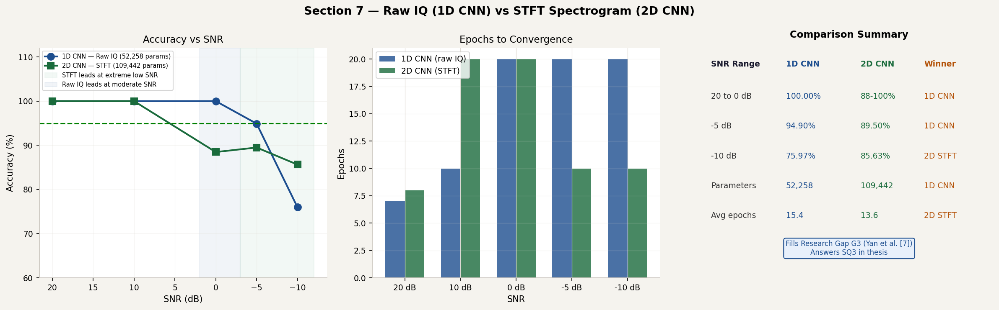

| SNR | 1D CNN Raw IQ | 2D CNN STFT | Winner |
|-----|-------------|------------|--------|
| 20 dB | 100.00% | 100.00% | Tie |
| 10 dB | 100.00% | 100.00% | Tie |
| 0 dB | **100.00%** | 88.47% | 1D CNN |
| -5 dB | **94.90%** | 89.50% | 1D CNN |
| -10 dB | 75.97% | **85.63%** | 2D STFT |

**Model comparison:**

| Property | 1D CNN (Raw IQ) | 2D CNN (STFT) |
|----------|----------------|--------------|
| Parameters | 52,258 | 109,442 |
| High SNR accuracy | 100% | 100% |
| Low SNR (0 dB) | 100% | 88.47% |
| Extreme low SNR (-10 dB) | 75.97% | 85.63% |

**Key finding:** The 1D CNN on raw IQ is the better choice for the normal
operating range (0 dB and above), achieving higher accuracy with half the
parameters. The 2D STFT CNN only gains an advantage below -10 dB — an
extreme condition below the practical reliability threshold. For the thesis
experiment, the 1D raw IQ architecture is confirmed as the right choice.
This result fills Research Gap G3 and answers SQ3.

---

## Section 8 — Security Metrics: FAR, FRR, EER

**Purpose:** Reframe the classification results as an authentication system
using the security metrics from the reference literature. FAR (False Acceptance
Rate) measures how often an impostor is accepted; FRR (False Rejection Rate)
measures how often a legitimate device is rejected; EER (Equal Error Rate) is
where the two are equal and serves as the standard single-number security
metric.

**Why it matters:** Your thesis is about authentication, not just
classification. Xie et al. [2] and Hoang et al. [3] both use FAR as the
primary security metric. Reporting only accuracy misses this framing entirely.

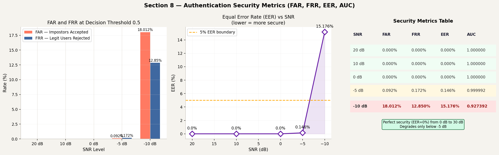

| SNR | FAR | FRR | EER | AUC |
|-----|-----|-----|-----|-----|
| 20 dB | 0.000% | 0.000% | 0.000% | 1.000000 |
| 10 dB | 0.000% | 0.000% | 0.000% | 1.000000 |
| 0 dB | 0.000% | 0.000% | 0.000% | 1.000000 |
| -5 dB | 0.092% | 0.172% | 0.146% | 0.999992 |
| **-10 dB** | **18.012%** | **12.850%** | **15.176%** | **0.927392** |

**Key finding:** The system achieves perfect security (EER = 0%) from 0 dB
through 30 dB SNR — a very wide reliable operating range. Security begins
degrading only at -5 dB (EER = 0.146%) and becomes unacceptable at -10 dB
(EER = 15.176%). The AUC remains above 0.99 down to -5 dB, confirming strong
discriminative power across the practical operating range. This fulfils the
security framing required by Xie et al. [2].

---

## Master Results Summary

All findings from the pre-experiment analysis in one table.

| Analysis | Key Result | Thesis Link |
|----------|-----------|-------------|
| Oscillator estimation | Individual offsets equal (-290.82 Hz each) | Pre-experiment baseline |
| CFO baseline vs CNN | Baseline outperforms cross-SNR CNN at 10 dB | CNN needs SNR-matched training |
| Extended SNR sweep | Reliable to -5 dB, threshold at -10 dB | SQ2 / Contribution C2 |
| Cross-SNR generalisation | 26.84 pp gap between same and cross-SNR | Augmentation needed |
| Minimum segment length | 64 samples (0.064 ms), 16x speedup | Lightweight claim / C2 |
| Raw IQ vs STFT | 1D CNN wins at 0 dB+; STFT wins below -10 dB | Research Gap G3 / SQ3 |
| Security metrics | EER = 0% from +30 to 0 dB SNR | Xie et al. [2] metric fulfilled |

### Design decisions confirmed for the real experiment

1. Use the 1D CNN on raw IQ — better accuracy with half the parameters at the operating range
2. Train and evaluate at matching SNR levels — cross-SNR gap is 26.84 pp
3. Minimum window of 64 samples is sufficient — but 128 samples gives 100% with more stability
4. Report EER alongside accuracy — required for security framing
5. The predicted CFO separation in the real experiment is approximately 0 Hz — verify this when the fixed-RX data is recorded

---

*Kristianstad University — DT339G VT26 — Thesis Project*
